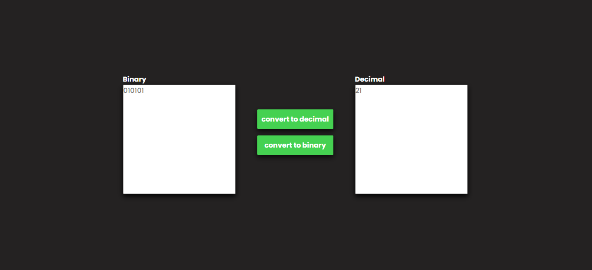

# Bin2Dec
<p align="center">

</p>

## Why
Based on the [Bin2Dec app ideas repository](https://github.com/florinpop17/app-ideas/blob/master/Projects/1-Beginner/Bin2Dec-App.md), this program converts decimal numbers to binaries and vice versa;

## Objectives/ Challenges
-   [x] Arrays may not be used to contain the binary digits entered by the user
-   [x] Determining the decimal equivalent of a particular binary digit in the
    sequence must be calculated using a single mathematical function, for
    example the natural logarithm. It's up to you to figure out which function
    to use.
-   [x] User can enter up to 8 binary digits in one input field
-   [x] User must be notified if anything other than a 0 or 1 was entered
-   [x] User views the results in a single output field containing the decimal (base 10) equivalent of the binary number that was entered
-   [x] User can enter a variable number of binary digits

## Instalation

To use it,choose a folder where it will be cloned or repository, open the / cmd terminal and use the * git * command below:
```
git clone https://github.com/JuanGustah/Bin2Dec.git
```
After that,open the index.html with the browser of your choice.